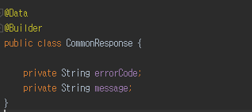
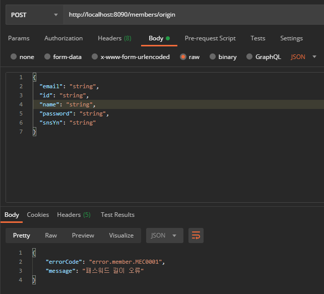
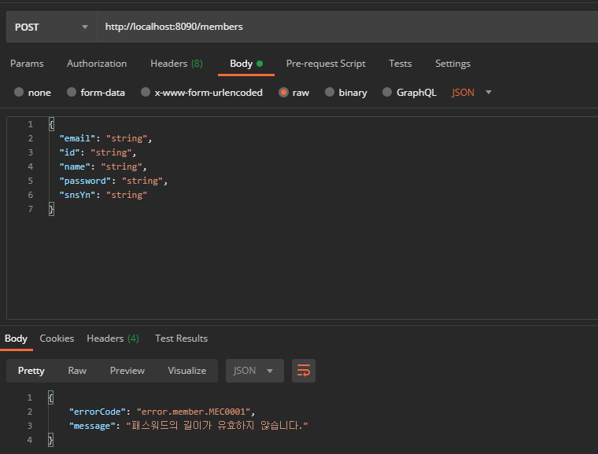
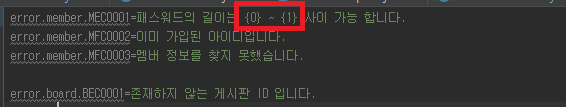
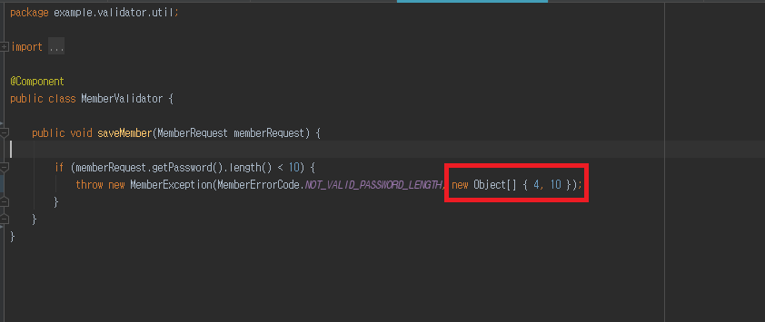
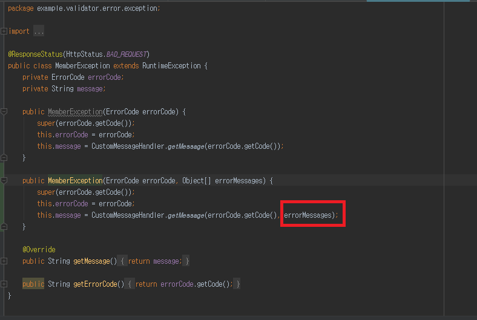
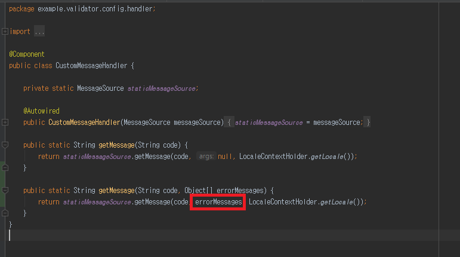
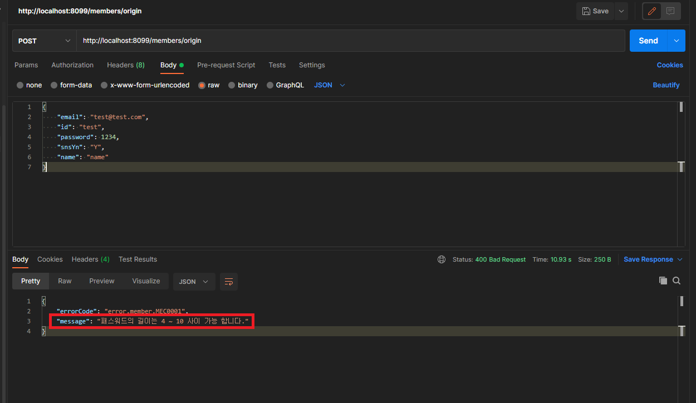

## Java Validator 관리
자바 스프링에서 Validator 관리 관련해서 이야기 해볼려고 합니다.

우선 해당 코드는 별도의 샘플 코드 기준으로 말하고자 합니다.
(https://github.com/syh8088/springboot-validator)

유효성 검사를 구현하기 위해서는 특정 기능에서 error code, error message, 그에 해당되는 response status codes 그리고 유효성 검사 비지니스 로직 등

관리 해야 합니다.

예를들어 회원가입시 패스워드 길이 제한 유효성 검사에서도 각각의 error code, error message 등 관리 해야 합니다.

서비스가 커지면 커질수록 이런 error code, error message, 유효성 검사 비지니스 로직 등

관리 해야 하니 많이 복잡 하게 됩니다.

이것을 유지보수 및 재사용 측면에서 어떻게 구현 해야 할지 고민 하게 됩니다.

우선 일반적인 코드를 보면서 설명 하도록 하겠습니다.

먼저 Response DTO 객체 입니다.

errorCode, message 를 관리 하고 있습니다.

Controller 단에서 회원가입 하기 위한 데이터를 받고 해당 데이터를 DB 에 저장 하기 위해 Service 단으로 전달 하게 됩니다.

※ 가능하면 패스워드 길이 체크 유효성 검사는 Controller 단에서 해결하는 것이 좋습니다.
저같은 경우 DB 로부터 데이터를 가져와서 유효성 검사 해야 되는 경우 그리고 서비스 단에서 어쩔수 없이 해야 되는 상황이라면
서비스 단에 유효성 검사 로직을 수행합니다.

Service 단에서 유효성 검사를 하게 되고 클라이언트로 부터 받은 데이터 중 패스워드가 10 이하 이라면 DB 에 저장 하지 않고

해당 되는 error code, error message 기입 후 클라이언트에게 전달 하게 됩니다.

여기서 문제가 있습니다. 지금은 로직이 간단하 규모가 커지지 않기에 한눈에 알아 볼 수 있고 간편하게 유지 보수 할 수 있겠지만

이런 유효성 검사 로직이 비지니스 로직 관리하는 서비스 단에 여러 군데 있다면 어떻게 될까요

핵심 비지니스 로직은 분명 시간이 지나면 규모가 커질테고 해당 유효성 검사를 수정하기 위해 찾는 것 또한 고생이 발생 됩니다.

유효성 검사 로직을 따로 다른 곳에 위임해서 관리 하는 것도 좋은 방향입니다. 이것뿐만 아니라 error code, error message, response status code 등

각각 상태와 행위를 한곳에서 관리 하면 좋지 않을까 합니다.

다시 서비스단으로 이동 합니다. 여기서 유효성 검사 상태 관리 및 행위를 Validator 에 옮겼습니다.

MemberValidator 는 회원 전용 유효성 검사 로직 관리 입니다. 앞으로 여기서 유효성 검사 로직은 여기서 관리 하게 됩니다.

클라이언트로 부터 받은 데이터 중 패스워드가 10 이하 이라면 RuntimeException  상속 받은 MemberException 이 예외 처리 하게 됩니다.

error code  Enum 활용 해서 관리 하게 되었습니다. Enum 장점을 활용 해서 각 error code 마다 본인 만의 계산식

즉 해당 error code 을 이용해서 그에 해당 되는 error message 를 출력 할 수 있도록 하였습니다. (밑에 CustomMessageHandler 을 보시면 이해가 될겁니다.)

RuntimeException 상속 받은 MemberException 입니다. 실질적으로 @ResponseStatus(HttpStatus.BAD_REQUEST) 이용해 응답 상태 코드 400번 으로 response 하게 됩니다.

예외처리시 나중에 알아보게 될 @ControllerAdvice 통해 예외처리 들어오면 해당 MemberException 을 받고 가동해서 최종적으로 response 하게 됩니다.

error code 를 전달 받은 CustomMessageHandler 는 실질적으로 error properties 에 저장된 메세지를 가져오고 해당 메세지를

구현한 Exception 에 전달 하는 역활을 합니다.

여기서 LocaleContextHolder.getLocale() 이 있는데

다국어 지원을 위한 MessageSource 를 설정 하는 CookieLocaleResolver(스프링 빈 통해 locale 을 한국으로 셋팅 한 상태) 통해

지정한 해당 메세지를 가져오게 합니다.

이제 마지막으로 @ControllerAdvice 통해 해당 Exception 발생 시 컨트롤러 및 캐치 해서 응답하는 역활 한다.

즉 여기서는 최종적으로 원하는 응답 형태에 집중 및 관리 합니다.

# 파라미터 값 통해 메세지 치환 해서 응답하기
메세지를 파라미터 값을 이용해서 가공 후 응답 해야 하는 경우가 있습니다.

이 경우 Bean 으로 등록한 스프링에서 지원 하는 MessageSource 를 이용하면 된다.

우선 해당 error properties 에서 치환 되는 문자열을 배열 인덱스 형태로 기입합니다.

Custom 한 MemberException 에 Object Array 통해 치환 하고자 하는 메세지를 같이 보낸다.

Bean 으로 등록한 MessageSource 2번째 인자값에 적용한다.

여기까지 유효성 검사에 대해 알아보았습니다.

여기서 말씀해주시고 싶은 것은 단순히 유효성 검사가 나중에 서비스가 커지면 관리하기가 어렵다는 것에

Exception 처리

error code

error message

response 구조

각각 관심사를 따로 분리 하였습니다.

이렇게 하면 유지보수의 측면에서 좋은 퍼포먼스를 기대 할 수 있을것 같습니다.

감사합니다.

